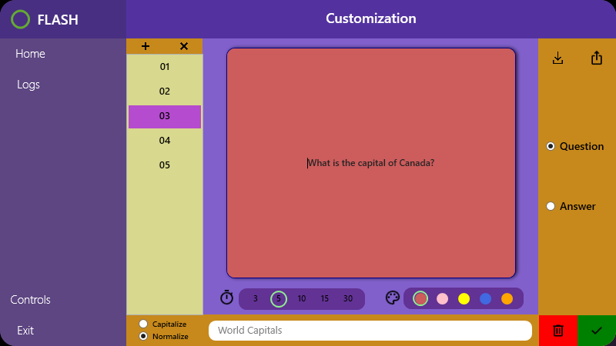
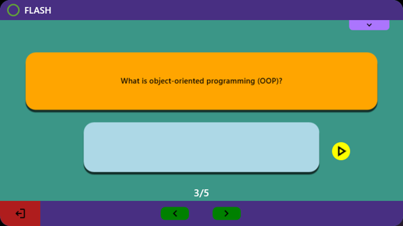

# Flash: A Dynamic Learning Application

**Flash** is an innovative application designed to revolutionize the learning process for students preparing for exams and tests. Developed in collaboration with @bestoxl and @VarArnas, **Flash** creates a fun and playful digital environment, making studying more efficient, intuitive, and enjoyable. Built using C# and .NET with WPF for GUI, and utilizing an SQL local database to store data, **Flash** offers a range of features to enhance the learning experience.

## Key Features:
* **Flashcard Management:** Users can create, delete, or edit flashcard sets within the intuitive flashcard options window. Additionally, a search feature allows for easy filtering of flashcards.
 </br>
* **Customization:** Customize individual flashcards to suit specific learning needs within the flashcard customization window, accessed through editing the flashcard set.
 </br>
* **Interactive Learning:** Test your knowledge with randomized flashcards by pressing the play button, providing a challenging yet effective learning experience.
 </br>
* **ChatGPT Integration:** Enter the ChatGPT play window mode for additional learning assistance. ChatGPT evaluates answers' likelihood, offering valuable feedback to enhance understanding.
 </br>
* **Statistics Tracking:** Monitor progress and performance through the statistics window, providing insights into learning patterns and areas for improvement.
 </br>
* **Program Shortcuts:** Utilize program shortcuts for easier navigation, enhancing user accessibility and efficiency.
 </br>
* **Timer Functionality:** Set timers for each flashcard to manage study sessions effectively and maintain focus.

 </br>
* **GPT mode** evaluating answers likelyhood.
 </br>
 </br>
 </br>
 </br>
* Ability to **alter the text** itself once playing the flashcards.
 </br>
* **Difficulty Settings:** Determine flashcard set difficulty based on customizable color options during flashcard customization.
 </br>
	
## How to run:
To run **Flash:**
1. Ensure dependencies are installed.
2. Set the local database full path inside DataContext.cs connection string for example : @"Data Source = C:\Users\arnas\Source\Repos\FLASH\FirstLab\FirstLab\src\data\myDatabase.db".
3. Update migrations in the console using ```dotnet ef database update```.
4. Build the application using ```dotnet build```.
5. Optionally, integrate ChatGPT's API key within OpenAIController.cs for enhanced functionality, either create your own with an OpenAI API account or use the one provided.

**Note:** Due to limited funding, a general ChatGPT API key is not provided. Users can add their own API key for ChatGPT integration
	

